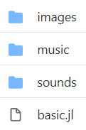

# Zero Overhead Game Development

## Overview
The aim of this package is to remove accidental complexity from the game development process. We therefore always choose simplicity and consistency over features. The users of this package will include young programmers learning their first language, maybe moving up from Scratch. While we aim to support reasonably sophisticated 2D games, our first priority will remain learners, and their teachers.

## Examples
The best way to learn how to use this package is by looking at code. There are some simple examples in the [example subdirectory](https://github.com/aviks/GameZero.jl/tree/master/example/BasicGame). More comprehensive examples are listed in the [GZExamples](https://github.com/SquidSinker/GZExamples) repository. The example source code can also be viewed as part of this documentation -- see the menu on the left. 

## Running games

Games created using GameZero are `.jl` files that live in any directory. To play the games, start the Julia REPL and:

```
pkg> add GameZero

pkg> add Colors

julia> using GameZero

julia> rungame("C:\\path\\to\\game\\Spaceship\\Spaceship.jl")

```

## Assets


Each game, and its assets, are stored in a separate directory. Within this directory, there is a .jl file, which stores the game code. As well as this, there are three subfolders for sounds, images, and music. The games are executed using the rungame function provided by the Game Zero package, meaning that games do not have to be Julia packages or modules, making it much simpler. An empty file also counts as a valid game.

## Initialising a screen
To initalise a screen, all that is needed to define a set of three global variables:
```
HEIGHT
WIDTH
BACKGROUND
```
All of these are optional, and if not specified, will default to 400x400, and a white background. `HEIGHT` and `WIDTH` should be integers, and `BACKGROUND` should be set to a `Colorant` object from [Colors](https://juliahub.com/ui/Packages/Colors/NKjaT)

## Actors
Game objects on-screen are represented as `Actors` which have several associated attributes. Using `Actors`, you can change position, change the image and check for collisions. However, not all moving parts need to be Actors as those without a specific image can be defined as a `Circle` or a `Rect`, which have the same associated attributes (apart from image). `Actors` are usually the primary game objects that you move around.

`a = Actor(image.png, xpos, ypos)`

## Rects, circles, and lines
GameZero.jl also includes basic geometric shapes. `Rects`, `Circles` and `Lines` can be used to do everything an `Actor` can, having the same attributes (apart from image).

```julia
r = Rect(xpos, ypos, width, height)
c = Circle(xpos, ypos, radius)
l = Line(xpos1, ypos1, xpos2, ypos2)
```

## Drawing in-game objects
To draw an in-game object, the `draw` function is used, which takes the object (Actor, Line, Rect or Circle) and renders it on-screen at its current position. If taking a shape (i.e. not an Actor), the draw function can also take a `colorant` object from [Colors.jl](https://github.com/JuliaGraphics/Colors.jl). This is done inside the `draw` game loop function (see [Draw and update methods](@ref)).

## Moving objects
All objects have many attributes to define position. The corners — `topleft`, `topright`, `bottomleft`, and `bottomright` — are tuples (x and y coordinates). The sides — `top`, `bottom`, `left` and `right` — read either the x or y coordinate (top and bottom are x, left and right are y). These position attributes can be used either to read position or to set position. In addition, objects also have an `x` and `y` attribute which are anchored to the top left of the objects. Finally, the `position` attribute is a synomym for `topleft`

## Draw and update methods
You write a game by defining your own `draw` and `update` methods. These functions are run by the game engine automatically every frame, meaning developers do not have to define their own event loop. The `update` function is used to change game state and attributes of the Actors and the `draw` function renders on-screen objects.

The `draw` method can be defined to take zero or one argument. If present, the single argument is the `Game` object. In other words, define one of

`function draw() .... end`

or

`function draw(g::Game) .... end`

The `update` method can be defined to take zero, one or two arguments. The first argument is the `Game` object, and the second argument is the the time step from the previous frame. 

`function update() .... end`

`function update(g::Game) .... end`

`function update(g::Game, dt) .... end`

## Keyboard inputs
To take an instantaneous input, define the `on_key_down()` in your game. This function can take upto three postional arguments: The `Game` object, the `key` and the `keymod`. You can define the function with zero, one, two or three arguments, depending on which values you need. However, since the
arguments are positional, the order matters. 

In other words, you can define one of:

`function on_key_down() .... end`

`function on_key_down(g) .... end`

`function on_key_down(g, key) .... end`

`function on_key_down(g, key, keymod) .... end`

For a constant input, such as for movement, you can check for keypress within the `update` function, via the `keyboard` attribute of the game object (`g.keyboard`).

## Mouse input
Mouse movement can be tracked defining the `on_mouse_move` function in your game. The inputs to the function should be the `Game` object, and the mouse  position as a tuple of numbers. For mouse clicks, use the `on_mouse_down` function, which takes as input the `Game` object, position, and the button.

`function on_mouse_move(g::Game, pos) .... end`

`function on_mouse_down(g::Game, pos, button) .... end`

## Playing sounds
To play sound effects, you can call the `play_sound` function. To play music on a loop, call the `play_music` function. Both these functions can take `.wav`, `.mp3` and `.ogg` files. 

## Timers
To set a timer in a normal program, `sleep` would be used. However, in this instance, this would cause the whole game to pause for that amount of time. Therefore, to avoid having to use a complicated `@async` loop, you can use the function `schedule_once`, which takes a function and a time in seconds, and sets the function to run after that amount of time.

## Animation
To animate an actor, the image is changed several times as seen in the loop below. Better animation is most likely coming very soon.
```julia
function shoot_animation()
    global shoot_frame
    if shoot_frame < 16
        space_pod.image = "space_pod_shoot" * string(shoot_frame) * ".png"
        shoot_frame += 1
        schedule_once(shoot_animation, 1/16)
    else
        space_pod.image = "space_pod.png"
    end
end
```
